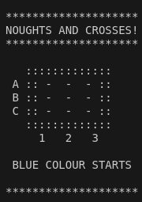

# Noughts and Crosses
The purpose of this project is create software for a noughts and crosses game.
The software exists in two versions, one written in C++ for running on a computer
and one written in C to be run on a ATtiny84 paired with a LED strip based on the WS2812 chip.



## Description
The game has ten buttons, nine corresponding to a noughts and crosses board
and one for reset.


## Getting Started

### Dependencies
Pololu-led-strip-avr
https://github.com/pololu/pololu-led-strip-avr

### Installing

1. Clone the repository and the dependencies repository
1. Build the code for ATtiny84 using the AVR 8-bit GNU toolchain

   ```
   avr-gcc -Wall -g -Os -mmcu=attiny84 -o main.bin main.c neopixel.c utils.c
   avr-objcopy -j .text -j .data -O ihex main.bin main.hex
   ```

1. Flash the microcontroller using i.e. AVRDUDE.
   
   `avrdude -p attiny84 -c usbasp -U flash:w:main.hex:i -F -P usb`

## Authors
Sara Rydh

## License
This project is licensed under the GPL License - see the LICENSE.md
file for details.


